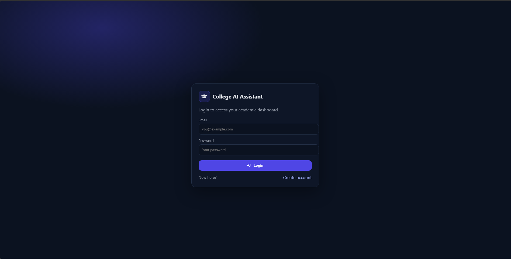
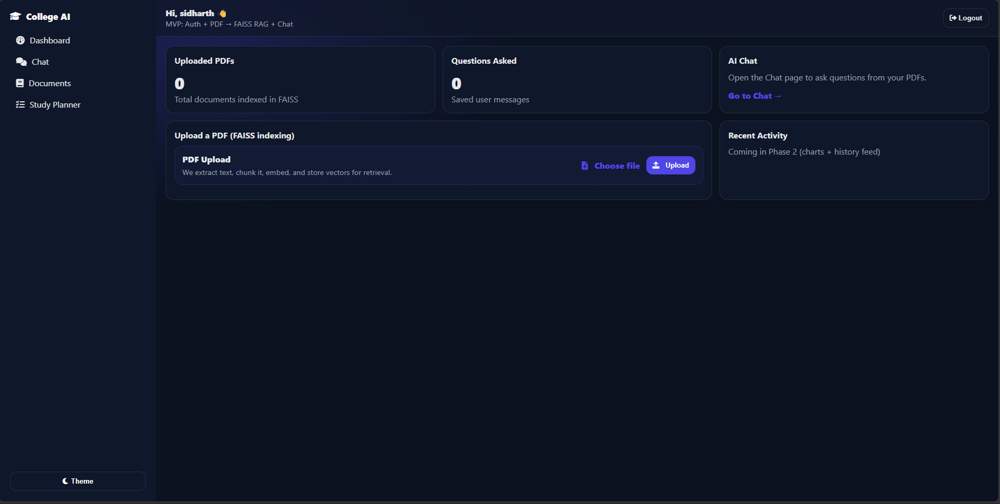
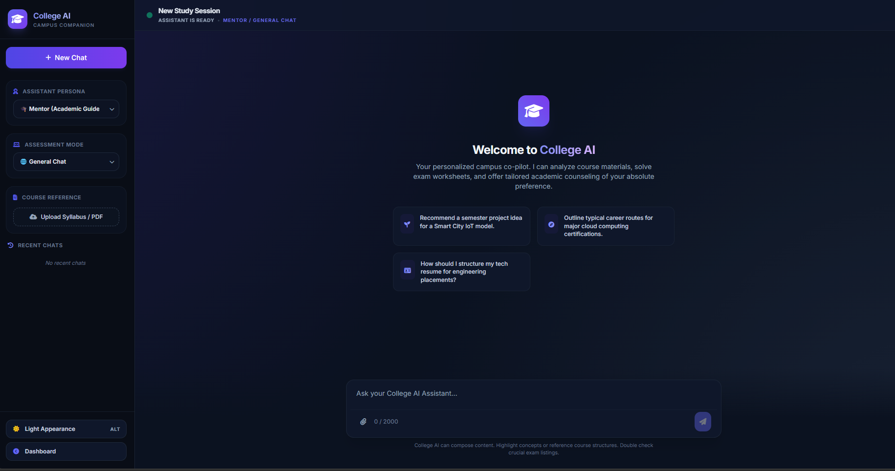
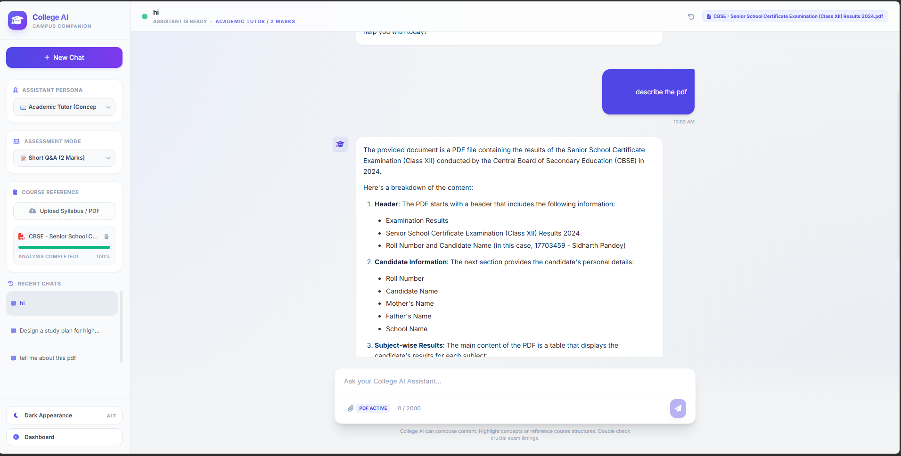
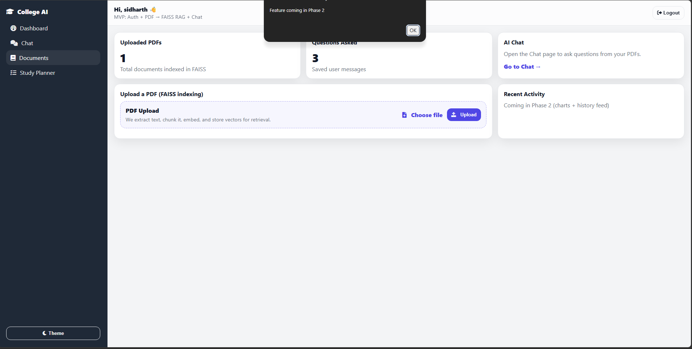

# 🎓 CollegeAI
### Your Intelligent AI Powered Campus Companion

<p align="center">


</p>

---

## 📖 Overview

CollegeAI is an AI powered campus companion designed to simplify academic life.

Instead of manually searching through notes, PDFs and course material, students can upload their documents and interact with them using natural language.

The assistant retrieves relevant information using Retrieval Augmented Generation (RAG), semantic search and Large Language Models to provide fast and accurate academic assistance.

---

# ✨ Features

✅ AI Chat Assistant

✅ PDF Upload & Processing

✅ Retrieval Augmented Generation (RAG)

✅ FAISS Vector Database

✅ Semantic Search

✅ Student Authentication

✅ Dashboard Analytics

✅ Study Planner

✅ Syllabus Analyzer

✅ Chat History

✅ Dark Theme UI

---

# 🖥️ Screenshots

## Login Page



---

## Dashboard



---

## AI Chat Interface



---

## Document Analysis



---

## Light Theme



---

# 🚀 How it Works

```
Student
     │
     ▼
Upload PDF
     │
     ▼
Extract Text
     │
     ▼
Chunking
     │
     ▼
Embeddings
(Sentence Transformers)
     │
     ▼
FAISS Vector Database
     │
     ▼
Semantic Retrieval
     │
     ▼
Groq LLM
     │
     ▼
AI Generated Answer
```

---

# 🛠 Tech Stack

### Backend

- Python
- Flask
- SQLite
- SQLAlchemy

### AI

- Groq API
- Sentence Transformers
- FAISS
- RAG Pipeline

### Frontend

- HTML
- CSS
- JavaScript

### Authentication

- Flask Session
- User Login
- User Registration

---

# 📂 Project Structure

```
CollegeAI/

│

├── app.py

├── config.py

├── requirements.txt

│

├── database/

│   ├── db.py

│   └── models.py

│

├── src/

│   ├── auth/

│   ├── chat/

│   └── syllabus/

│

├── templates/

│

├── static/

│

├── uploads/

│

└── instance/

```

---

# ⚙️ Installation

Clone Repository

```bash
git clone https://github.com/sauru2007/CollegeAI.git
```

Move into project

```bash
cd CollegeAI
```

Create Virtual Environment

```bash
python -m venv .venv
```

Activate

Windows

```bash
.venv\Scripts\activate
```

Linux / macOS

```bash
source .venv/bin/activate
```

Install Requirements

```bash
pip install -r requirements.txt
```

Run Application

```bash
python app.py
```

Open

```
http://127.0.0.1:5000
```

---

# 🔑 Environment Variables

Create

```
.env
```

Example

```env
GROQ_API_KEY=your_api_key_here
SECRET_KEY=your_secret_key
```

---

# 📚 Current Modules

| Module | Status |
|---------|---------|
| Authentication | ✅ |
| Dashboard | ✅ |
| AI Chat | ✅ |
| PDF Upload | ✅ |
| FAISS Search | ✅ |
| Study Planner | ✅ |
| Syllabus Analyzer | ✅ |
| User Sessions | ✅ |

---

# 🧠 AI Pipeline

```
User Question

↓

Embedding Generation

↓

Semantic Search (FAISS)

↓

Relevant PDF Chunks

↓

LLM Prompt

↓

Groq API

↓

Final Response
```

---

# 🎯 Future Roadmap

- OCR Support
- Voice Chat
- Multi Language Support
- Timetable Generator
- Attendance Prediction
- Assignment Generator
- Mobile Application
- Teacher Dashboard
- Student Analytics
- Cloud Database
- Multi PDF Search
- Image Understanding
- AI Resume Builder
- Campus Navigation
- Notes Recommendation Engine

---

# 📊 Highlights

- Secure Authentication
- Retrieval Augmented Generation
- Semantic Search
- Fast Response Generation
- Clean Modern UI
- Modular Architecture
- Easily Extendable

---

# 🤝 Contributing

Contributions are welcome.

1. Fork the repository

2. Create a feature branch

```
git checkout -b feature-name
```

3. Commit

```
git commit -m "Added feature"
```

4. Push

```
git push origin feature-name
```

5. Create a Pull Request

---

# 📄 License

This project is licensed under the MIT License.

---

# 👨‍💻 Author

**Sidharth Pandey**

BCA Student

AI • Machine Learning • Software Development

GitHub

https://github.com/sauru2007

---

## ⭐ Support

If you found this project useful,

⭐ Star this repository.

It helps others discover the project and supports future development.
